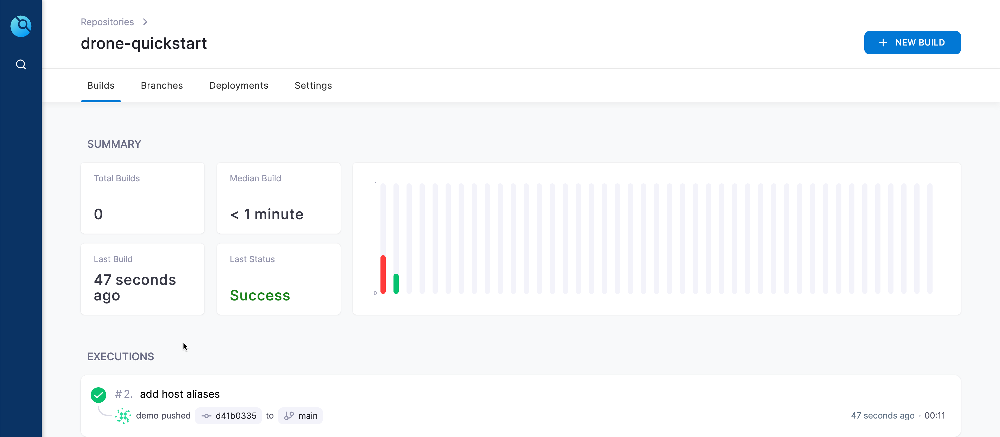

🚀 Introduction
===============

In this step we will write a Drone pipeline for an applicaiton that will verify that all required components are working.

☑️ Prepare `dag-setup-verifier` repository
=======================================

Activating a repo in Drone creates a webhook in the Gitea repository that sends events to Drone.

To activate the `dag-setup-verifier` repo, run the following command:

```shell
drone repo enable user-01/dag-setup-verifier
```

Navigate to the git repositories home directory i.e. `$GIT_REPOS_HOME` using **Terminal 1** tab,

```shell
cd $GIT_REPOS_HOME
```

```shell
git clone http://kubernetes-vm.${_SANDBOX_ID}.instruqt.io:30950/user-01/dag-setup-verifier.git
cd dag-setup-verifier
```

Use the `instruqt` branch,

```shell
git checkout instruqt
```

Edit the `.envrc.local` file to match your settings,

```shell
export DRONE_SERVER=http://kubernetes-vm.${_SANDBOX_ID}.instruqt.io:30980
export DRONE_TOKEN="your drone token from drone account settings page"
```

> **TIP**: You can copy the `.envrc.local` from `$GIT_REPOS_HOME/dag-stack.git`, as we have already copied the token from drone account settings page.
> ```shell
> cp $GIT_REPOS_HOME/dag-stack/.envrc.local .
> ```

```shell
direnv allow .
```

Ensure our drone token works,

```shell
drone info
```

Kubernetes nameserver
=====================

Since NXRM is running inside the Kubernetes cluster behind a service, the Kubernetes nameserver needs to be passed to the Drone Docker plugin when building the container.

Retrieve the `/etc/resolv.conf` file from a temporary pod by running this command:

```shell
kubectl run -i --tty busybox --image=busybox --restart=Never -- cat /etc/resolv.conf
```

You should see output similar to this:

<pre>
search default.svc.cluster.local svc.cluster.local cluster.local pguvupthd4vq.svc.cluster.local c.instruqt-prod.internal google.internal
nameserver 10.43.0.10
options ndots:5
</pre>

Here, `10.43.0.10` is the nameserver.

Network MTU
===========

Depending on how your Kubernetes cluster in the VM has been configured, the MTU (Maximum Transmission Unit) might be different. When creating temporary Docker networks in Kubernetes pods (which we are about to do when we build our container), this value must be the same as or smaller than the host.

Retrieve the MTU value with this command

```shell
ifconfig | grep cni
```

The command should show an output like:

```shell
cni0: flags=4163<UP,BROADCAST,RUNNING,MULTICAST>  mtu 1410
```

Update the value as per the `mtu` value shown in the output of the command.

Also verify that the IP in `custom_dns` matches the nameserver retrieved in the previous step. Notice that `8.8.8.8` (a DNS server from Google) is also passed to `custom_dns`. This is required since the Docker build process needs to resolve external DNS entries as well.

Edit `.drone.yml` using the **Code** tab, ensure that `.drone.yml` updated to be like,

```yaml
---
kind: pipeline
type: docker
name: default

# update this if you want to do arm64 build
platform:
  os: linux
  arch: amd64

# Trigger only main
trigger:
  branch:
  - instruqt

steps:

  - name: publish
    image: plugins/docker:20.13
    pull: if-not-exists
    settings:
      tags: "latest"
      dockerfile: docker/Dockerfile.linux.arm64
      insecure: true

      # verify these two values
      custom_dns: "10.43.0.10,8.8.8.8"
      mtu: 1410

      build_args:
        - "MAVEN_REPOS=nexus=http://nexus.infra:8081/repository/maven-public/"
      registry: nexus.infra.svc.cluster.local
      repo: nexus.infra.svc.cluster.local/example/dag-setup-verifier
      username:
        from_secret: image_registry_user
      password:
        from_secret: image_registry_password
```

Add Secrets
-----------

As you notice we have `from_secrets` attributes in the `.drone.yml`.

Drone supports multiple methods of managing secrets. Here we will use `drone encrypt` to encrypt strings and add them directly to the `.drone.yml` file.

```shell
./scripts/add-secrets.sh | tee -a .drone.yml
```

You should see output similar to this:

<pre>---
kind: secret
name: image_registry_user
data: jK/T9GzbNyxFmjlZhB/pgb6Kykm/ynGah4IPRXJTGn5w

---
kind: secret
name: image_registry_password
data: 1OaeL3iqFVv2nEM5v8dNWux+eTXwjanbB5A60g4lq18uQJ61
</pre>

Commit and push the code to see the build trigger

```shell
git add .drone.yml
git commit -m "Verify Setup"
git push origin instruqt
```

Check the build status in the Drone Dashboard,



🏁 Finish
=========
**Congratulations**!!! You are now a GitOpsian. Add other projects of yours and keep rocking with Drone CI and Argo CD.

Few applications that you can try with this stack,

- <https://github.com/harness-apps/quarkus-springboot-demo-gitops>
- <https://github.com/harness-apps/MERN-Stack-Example>

To complete this challenge, press **Check**.
