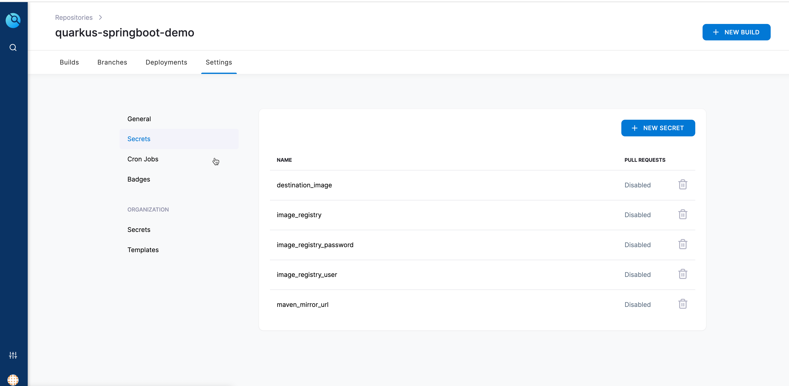
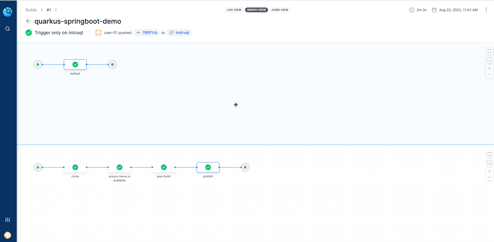

👋 Introduction
===============

It is always a challenge to build Java applications for cloud i.e building a container image out of Java source code. Though there are lot of tools that exists to do this, but getting them to work with your CI is a challenge.

Let us break that that myth and lean how we can use Drone CI to make the CI task of Java applications to much simpler and easier.

Setup Drone Pipeline
====================

Navigate to the git repositories home directory i.e. `$GIT_REPOS_HOME` using **Terminal 1** tab,

```shell
cd $GIT_REPOS_HOME
```

Clone the `quarkus-springboot-demo(QSBD)` repository and navigate to the same,

```shell
git clone http://kubernetes-vm.${_SANDBOX_ID}.instruqt.io:30950/user-01/quarkus-springboot-demo.git
```

Navigate to the cloned repo directory

```shell
cd quarkus-springboot-demo
```

Check out the `instruqt` of the application,

```shell
git checkout instruqt
```

> **NOTE**: errors like _direnv: error /root/repos/quarkus-springboot-demo/.envrc is blocked. Run `direnv allow` to approve its content_ are expected and they are fixed by running `direnv allow .` as shown below.

Reload the environment variables,

```shell
direnv allow .
```

Using the **Java App** tab edit the `quarkus-springboot-demo` project and  create a file `.envrc.local` with the following contents,

```shell
export DRONE_SERVER="http://kubernetes-vm.${_SANDBOX_ID}.instrqut.io:30980"
export DRONE_TOKEN="drone token from the drone account settings page"
```

> **TIP**: You can copy the `.envrc.local` from `$GIT_REPOS_HOME/dag-stack.git`, as we have already copied the token from drone account settings page.
> ```shell
> cp $GIT_REPOS_HOME/dag-stack/.envrc.local .
> ```

Refresh the local environment by running,

```shell
direnv allow .
```

Let is ensure the drone token works,

```shell
drone info
```

Activate the Repository
-----------------------

We need to activate the `quarkus-springboot-demo` in Drone, so that the git events on those repositories can trigger Drone builds.

Run the following command to activate the `quarkus-springboot-demo`,

```shell
drone repo enable "${QSBD_GIT_REPO}"
```

Add Secrets to Drone Repository
-------------------------------

Here we will use `drone secret add` to create secrets that are attached to the `quarkus-springboot-demo` repository in Drone.

- `maven_mirror_url` : The maven mirror to used by Apache Maven builder to download the artifacts.
- `destination_image`: The container image name. Default to `${REGISTRY_NAME}/example/quarkus-springboot-demo`.
- `image_registry`: The Image registry to use. Derived from environment variable `${REGISTRY_NAME}`.
- `image_registry_user`: The Image registry username to authenticate.  Derived from environment variables `${IMAGE_REGISTRY_USER}`.
- `image_registry_password`: The Image registry user password to be used while authentication authenticate. Derived from environment variables `${IMAGE_REGISTRY_PASSWORD}`.

Run the following script to add the secrets to the Drone repo `${QSBD_GIT_REPO}`,

```shell
drone secret add --name maven_mirror_url --data 'http://nexus.infra:8081/repository/maven-public/' "${QSBD_GIT_REPO}"

drone secret add --name destination_image --data "${REGISTRY_NAME}/example/quarkus-springboot-demo" "${QSBD_GIT_REPO}"

drone secret add --name image_registry --data "${REGISTRY_NAME}" "${QSBD_GIT_REPO}"

drone secret add --name image_registry_user --data "${IMAGE_REGISTRY_USER}" "${QSBD_GIT_REPO}"

drone secret add --name image_registry_password --data "${IMAGE_REGISTRY_PASSWORD}" "${QSBD_GIT_REPO}"
```

> TIP: you can also use the utility scripts from `./scripts` to add, update and delete scripts
>```shell
> ./scripts/add-secrets.sh
>```



Update .drone.yml
-----------------

Make sure the `mtu` value for the Docker plugin is set to right value in as per the environment,

```shell
ifconfig | grep cni
```

The command should show an output like,

&lt;pre&gt;
cni0: flags=4163<UP,BROADCAST,RUNNING,MULTICAST>  mtu 1410
&lt;/pre&gt;

Update the value as per the `mtu` value shown in the output of the command. In the output above the `mtu` value is `1410`.

Trigger Pipeline
----------------

Now push the local modifications to the git.

```shell
git commit --allow-empty -m "Init Pipeline"
git push origin "${QSBD_GIT_REV}"
```

The git **push** event will trigger a build on Drone. Open the **Drone** tab and navigate to `quarkus-springboot-demo` to see the build running.



> **NOTE**:
> The first build will take some time during java-build step as Apache Maven need to > download the artifacts from Maven Central and cache them on to the local Nexus Repository Manager.
>
>
> **TIP**: To test triggers you can also use git command like `git commit --allow-empty -m "Test Trigger"`

🏁 Finish
=========

To complete this challenge, press **Check**.
