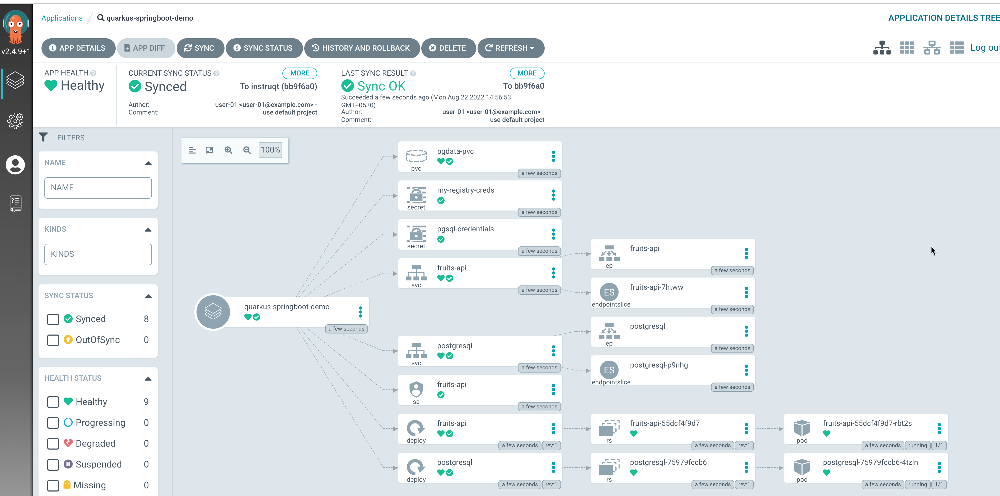
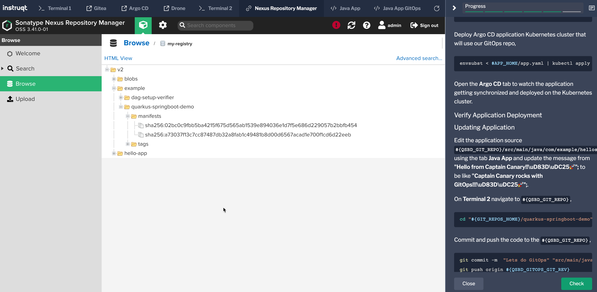

👋 Introduction
===============

GitOps is a way of implementing Continuous Deployment for cloud native applications. It focuses on a developer-centric experience when operating infrastructure, by using tools developers are already familiar with, including Git and Continuous Deployment tools.

The core idea of GitOps is having a Git repository that always contains declarative descriptions of the infrastructure currently desired in the production environment and an automated process to make the production environment match the described state in the repository. If you want to deploy a new application or update an existing one, you only need to update the repository - the automated process handles everything else. It’s like having cruise control for managing your applications in production.

> Source: <https://www.gitops.tech/>

Clone Repository
----------------

Navigate to the git repositories home directory i.e. `$GIT_REPOS_HOME` using **Terminal 2** tab,

```shell
cd $GIT_REPOS_HOME
```

Clone the `quarkus-springboot-demo-gitops` repository and navigate to the same,

```shell
git clone http://kubernetes-vm.${_SANDBOX_ID}.instruqt.io:30950/user-01/quarkus-springboot-demo-gitops
```

Navigate to the cloned repo directory

```shell
cd quarkus-springboot-demo-gitops
```

Check out the `instruqt` of the application,

```shell
git checkout instruqt
```

Enable the environment variables,

```shell
direnv allow .
```

GitOps
------

Update the App helm `$APP_GITOPS_HOME/helm_vars/values.yaml`

```shell
envsubst < "$APP_GITOPS_HOME/helm_vars/values.tpl.yaml" > "$APP_GITOPS_HOME/helm_vars/values.yaml"
```

Commit and push the code to git repo,

```shell
git commit --allow-empty -m "Init GitOps"
git push origin ${QSBD_GITOPS_GIT_REV}
```

Deploy Argo CD application Kubernetes cluster that will use our GitOps repo,

```shell
kustomize build $APP_GITOPS_HOME/k8s | envsubst  | kubectl apply -f -
```

Open the **Argo CD** tab and choose project `java-apps` from the filters.



Verify Application Deployment
-----------------------------

Let us check the pods on `demo-apps` namespace,

```shell
kubectl get pods -n demo-apps
```

The command should show an output like,

&lt;pre&gt;
NAME                          READY   STATUS    RESTARTS   AGE
fruits-api-55dcf4f9d7-sgwrq   1/1     Running   0          3m41s
postgresql-75979fccb6-gqkwf   1/1     Running   0          3m41s
&lt;/pre&gt;

Let us check the services,

```shell
kubectl get svc -n demo-apps
```

The command should show an output like,

&lt;pre&gt;
NAME         TYPE        CLUSTER-IP      EXTERNAL-IP   PORT(S)          AGE
fruits-api   ClusterIP   10.43.147.230   &lt;none&gt;        8080/TCP         4m51s
postgresql   NodePort    10.43.7.161     &lt;none&gt;        5432:32416/TCP   4m51s
&lt;/pre&gt;

Let port-forward the service `fruits-api` allowing us to access the service from the CLI,

```shell
kubectl port-forward -n demo-apps svc/fruits-api 8080:8080 &
```

Let us call the simple greeting REST service,

```shell
http :8080/
```

The command should return a response like,

&lt;pre&gt;
HTTP/1.1 200
Connection: keep-alive
Content-Length: 35
Content-Type: text/plain;charset=UTF-8
Date: Mon, 22 Aug 2022 09:06:15 GMT
Keep-Alive: timeout=60

Hello from Captain Canary!!🐥🚀
&lt;/pre&gt;

Run the following command and make a note of the image **sha256** digest,

```shell
kubectl get deploy -ndemo-apps  fruits-api -ojsonpath='{.spec.template.spec.containers[0].image}'
```

> **NOTE**: It might take few seconds for the tag of the image to be refreshed with the sha256 digest. You can also try doing **Hard Refresh** from the Argo CD Dashboard --> `quarkus-springboot-demo` app. That will update the application to the latest digest from the registry.

Updating Application
--------------------

Using the tab **Java**, edit the application source `${QSBD_GIT_REPO}/src/main/java/com/example/hellospringboot/GreeterController.java` and update the class to as shown,

```java
package com.example.hellospringboot;

import org.springframework.web.bind.annotation.GetMapping;
import org.springframework.web.bind.annotation.RestController;

/**
 * GreeterController
 */
@RestController
public class GreeterController {

    @GetMapping
    public String hello() {
        return "Captain Canary rocks with GitOps!!!\uD83D\uDC25🚀";
    }

}
```

That is updating the message from  **Hello from Captain Canary!!\uD83D\uDC25🚀** to **Captain Canary rocks with GitOps!!!\uD83D\uDC25🚀**.

On **Terminal 2** navigate to `${QSBD_GIT_REPO}`,

```shell
cd "${GIT_REPOS_HOME}/quarkus-springboot-demo"
```

Commit and push the code to the `${QSBD_GIT_REPO}`,

```shell
git commit -m  "Lets do GitOps" "src/main/java/com/example/hellospringboot/GreeterController.java"
git push origin ${QSBD_GITOPS_GIT_REV}
```

The action above should trigger a drone build. You can check the same by navigating to **Drone** dashboard. Once the build is successful you should see the updated image getting pushed to the registry.

Click open the `quarkus-springboot-demo` application on the Argo CD dashboard and watch the deploy, in few seconds it should start to sync with the latest image change i.e. the image that was pushed to the image repository via drone build.

Run the following command and make a note of the image **sha256** digest of the updated app,

```shell
kubectl get deploy -ndemo-apps  fruits-api -ojsonpath='{.spec.template.spec.containers[0].image}'
```

The image digest in the earlier step and the one from above should be different.

You can also verify the image and its digests using the **Nexus Repository Manager** tab,



As part of the rollout the earlier port-forward would have been killed. Let us do the port-forward again to the service `fruits-api`,

```shell
kubectl port-forward -n demo-apps svc/fruits-api 8081:8080 &
```

Now try the `http :8081/` request and you will see the following output,

```shell
HTTP/1.1 200
Connection: keep-alive
Content-Length: 43
Content-Type: text/plain;charset=UTF-8
Date: Mon, 22 Aug 2022 09:31:24 GMT
Keep-Alive: timeout=60

Captain Canary rocks with GitOps!!!🐥🚀
```

As used the [_Git write back_](https://argocd-image-updater.readthedocs.io/en/stable/configuration/applications/) method for updating the images, you will notice a new file called `.argocd-source-quarkus-springboot-demo.yaml` created under the app folder of the `quarkus-springboot-demo-gitops` repository.

Shift to `Terminal 1`,

```shell
git pull --rebase origin instruqt
```

Let us get the latest digest that has been applied to our manifests,

```shell
yq '.helm.parameters[1].value' app/.argocd-source-quarkus-springboot-demo.yaml
```

And now Let us get the latest digest from our private registry,

```shell
~/go/bin/crane digest localhost:31081/example/quarkus-springboot-demo
```

Finally let us get the sha256 from our deployment manifest,

```shell
kubectl get deploy -ndemo-apps  fruits-api -ojsonpath='{.spec.template.spec.containers[0].image}' | cut -d'@' -f2
```

The out of all the three commands i.e. the image sha256 digest, should be same.

Congratulations. You now successfully applied GitOps(Continuous Deployment) using Argo CD and integrated it with Drone CI to support with Continuous Integration.

🏁 Finish
=========

To complete this challenge, press **Check**.
